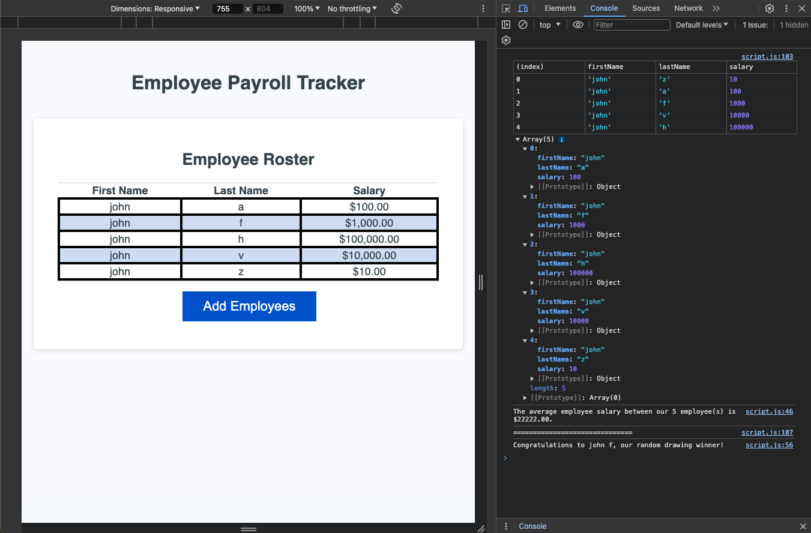

# payroll-tracker

## challenge 3 - Employee Payroll Tracker

## Description

This assignment is a modification of starter code to functionalize an application that enables a payroll manager to view and manage employee payroll data.

## Table of Contents

- assets folder
    - css folder
        - style.css
    - images folder
    - js folder
        - script.js
- index.html file
- README.md File

## Mock-Up

## Link

- Deployed: https://nunezzdavid.github.io/payroll-tracker
- GitHub: https://github.com/nunezzdavid/payroll-tracker.git

## Tasks

- WHEN I click the "Add employee" button THEN I am presented with a series of prompts asking for first name, last name, and salary
- WHEN I finish adding an employee THEN I am prompted to continue or cancel
- WHEN I choose to continue THEN I am prompted to add a new employee
- WHEN I choose to cancel THEN my employee data is displayed on the page sorted alphabetically by last name, and the console shows computed and aggregated data

## Credits

- starter code
- https://developer.mozilla.org/en-US/docs/Web/JavaScript/Reference/Statements/while
- https://developer.mozilla.org/en-US/docs/Web/JavaScript/Reference/Global_Objects/Math/random
- https://developer.mozilla.org/en-US/docs/Web/JavaScript/Reference/Statements/return

## License

MIT License

Copyright (c) 2024 David Nunez Lopez

Permission is hereby granted, free of charge, to any person obtaining a copy of this software and associated documentation files (the "Software"), to deal in the Software without restriction, including without limitation the rights to use, copy, modify, merge, publish, distribute, sublicense, and/or sell copies of the Software, and to permit persons to whom the Software is furnished to do so, subject to the following conditions:

The above copyright notice and this permission notice shall be included in all copies or substantial portions of the Software.

THE SOFTWARE IS PROVIDED "AS IS", WITHOUT WARRANTY OF ANY KIND, EXPRESS OR IMPLIED, INCLUDING BUT NOT LIMITED TO THE WARRANTIES OF MERCHANTABILITY, FITNESS FOR A PARTICULAR PURPOSE AND NONINFRINGEMENT. IN NO EVENT SHALL THE AUTHORS OR COPYRIGHT HOLDERS BE LIABLE FOR ANY CLAIM, DAMAGES OR OTHER LIABILITY, WHETHER IN AN ACTION OF CONTRACT, TORT OR OTHERWISE, ARISING FROM, OUT OF OR IN CONNECTION WITH THE SOFTWARE OR THE USE OR OTHER DEALINGS IN THE SOFTWARE.